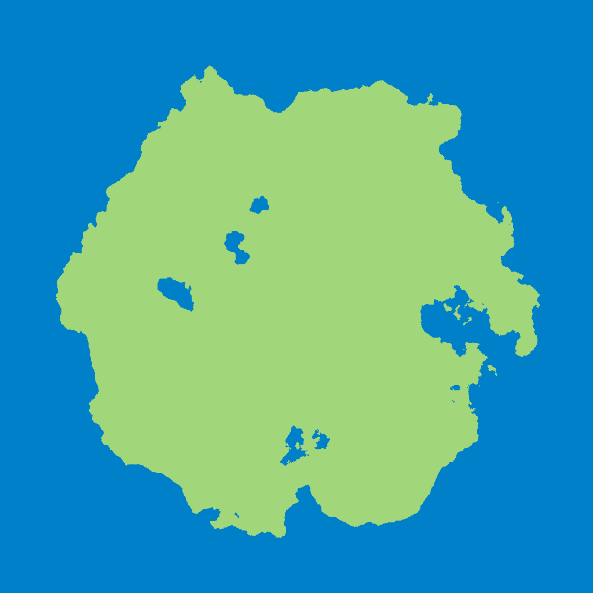
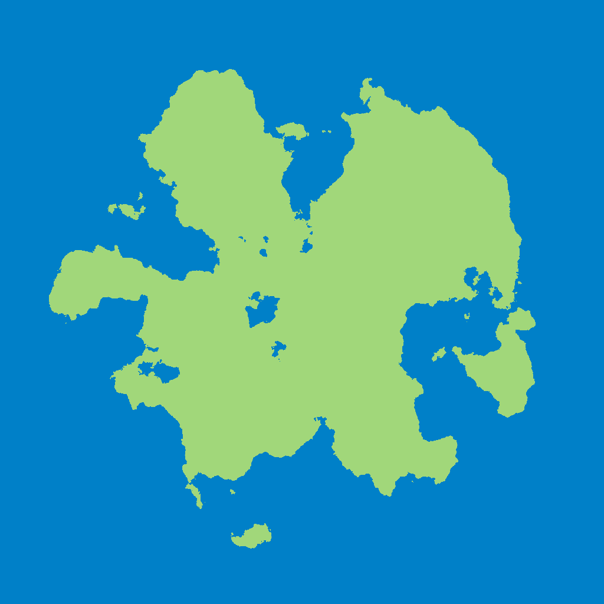
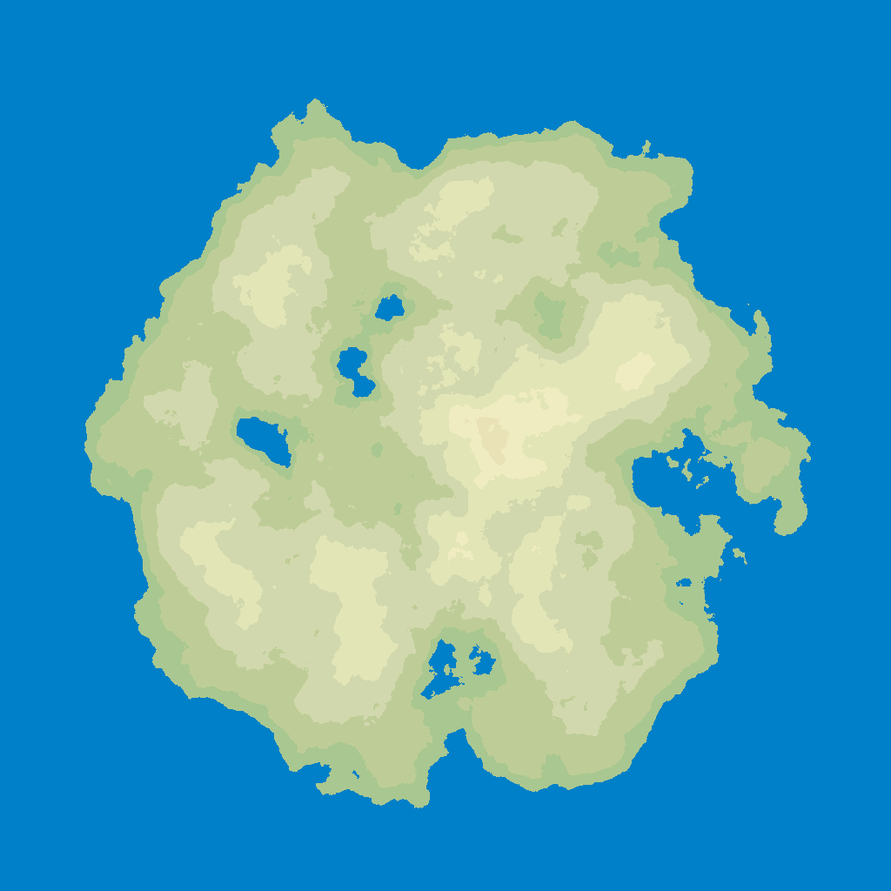
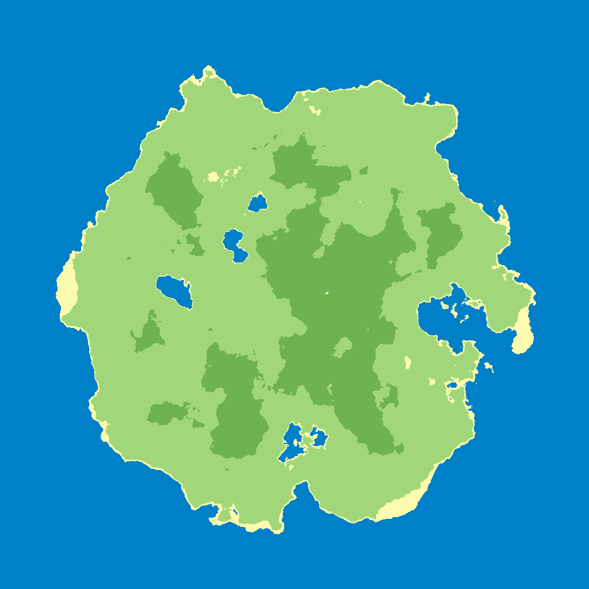

# island
### Simple Island Generator and Renderer

[Algorithm](#algorithm)

## Requirements

  1. C++ compiler
  2. Python 3
  3. Python modules: `pypng` and `Pillow`.

Compile the generators (at the moment, only Simplex):

    $ make

Now, you'll get a `SimplexIslandGen` executable in the `bin/` directory.
   

## Generating an Island

    $ bin/SimplexIslandGen
    Usage: ./SimplexIslandGen SIZE OUTPUT-FILENAME [SEED or "SEED=unset"] [LOWER-BOUND UPPER-BOUND]

Only `SIZE` and `OUTPUT-FILENAME` are necessary.

To generate, for example, an island of size 1024 x 1024:

    $ bin/SimplexIslandGen 1024 island.hmap
    Image size: 1024
	Saving data to filename: island.hmap
	Seed (unique ID): 929654437
	Lower bound: 0
	Upper bound: 1

The program will output `island.hmap`, containing the height values generated.

Now you can [render](#rendering-an-island) this file into an image:

Adjusting the `LOWER-BOUND UPPER-BOUND` argument can make the island's shape much more interesting.
For example, try:

    $ bin/SimplexIslandGen 1024 island.hmap SEED=unset -0.25 1.0
    Image size: 1024
	Saving data to filename: island.hmap
	Seed (unique ID): 73068098
	Lower bound: -0.25
	Upper bound: 1

## Rendering an Island

Two Python scripts are provided for rendering the `.hmap` files: `IslandRender.py` and `Island3DRender.py`.

### Simple 2D Rendering

Use the provided `IslandRender.py` with a `.hmap` file generated.

For example, using the `island.hmap` we generated before:

    $ python3 IslandRender.py island.hmap island.png

Outputs a PNG file with the rendered island divided into water/land.

#### Render heights as colors

Add the flag `--mode=color-heights`.

    $ python3 IslandRender.py island.hmap island.png --mode=color-heights

#### Render biomes

Generate another file, of same size as the `.hmap`, like this:

    $ bin/SimplexIslandGen 1024 island.biome
    Image size: 1024
	Saving data to filename: island.biome
	Seed (unique ID): 2007696746
	Lower bound: 0
	Upper bound: 1

Now use `IslandRender.py` like this:

    $ python3 IslandRender.py island.hmap island.png --mode=biome --biome-file=island.biome

The `island.biome` is a moisture map.

Biomes are calculated as a function of elevation and moisture. 
See the `biome(elevation, moisture)` function in `IslandRender.py` to adjust it.

#### Colors

Colors for the rendering are defined in `IslandRenderColors.json`. Modify it to your liking.

#### Other Options

Run `IslandRender.py` with `--help`.

### 3D Rendering

Needs the following modules: `numpy`, `matplotlib`.

Renders the island as an `x, y, z` graph using `matplotlib`. Slow.

## Algorithm

For now, only the Simplex algorithm is implemented.

I made a custom Simplex generator inspired by [python-rpg's version](https://github.com/Greymerk/python-rpg/blob/master/src/world/terrain/simplex.py), since neither LibNoise, nor FastNoise provided the customization I wanted.

## File Formats

The `.hmap` and `.biome` files generated are simply space-and-newline separated file, containing height/moisture values.